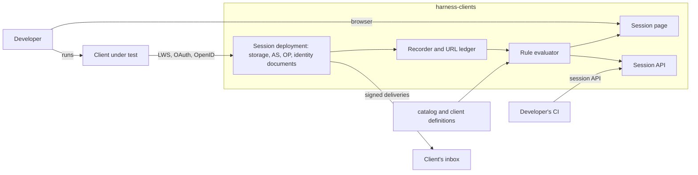

# Touchstone for LWS clients — design

**Status: phases C0 and C1 are built ([D-0076](DECISIONS.md), D-0077). C2's rule format is
proposed and waits at Gate C (D-0078). The rest is design (D-0075).**
This brief extends [DESIGN.md](DESIGN.md), whose rules still hold: the catalog is the source
of truth, tests are data, the harness is tested against reference and broken twins, and
every deviation gets a DECISIONS.md entry.

---

## 1. Mission

Touchstone tests LWS servers by playing the client. This extension tests **LWS clients** by
playing everything a client talks to: the storage, its authorization server, an OpenID
Provider, the hosts of identity documents, and the notification server that calls the
client's inbox.

The client developer runs their own client. Touchstone gives them a session: their own
storage and identities, a checklist of things to try, and a web page with live feedback.
Touchstone serves every request for real, records it, judges it against the client
requirements in the catalog, and explains each finding: what the client sent, which clause
it breaks, and what to change.

The LWS drafts define an LWS Client conformance class: "an HTTP client [RFC 9112] that
complies with all of the relevant 'MUST' statements in this specification"
(`req:conformance-client-class`). The client obligations number about twenty, and nearly all
of them show in the requests a server receives. §11 lists them.

## 2. Settled decisions

These follow D-0075. Do not relitigate them without a new decision.

1. **The developer drives the client; Touchstone never does.** There are no adapters, no
   per-language bindings, and no MCP-controlled client harness. The only interface is
   HTTP, which every LWS client already speaks: the client uses the session's storage, and
   the developer's own scripts or CI use the session API (§4.4).
2. **Touchstone implements the server side itself.** The session deployment grows out of
   `RefLwsServer` and `RefAuthorizationServer` in `harness-fixtures`. Touchstone takes no
   dependency on lws-server, Halcyon or any other implementation. It grades those servers,
   so their behaviour must not become the yardstick for clients.
3. **Same catalog, same definitions, same reports.** Client rules are YAML-LD definitions
   that cite catalog requirements (§5). Results come out as EARL, JUnit XML and the HTML
   report family.
4. **A failure always cites a clause.** Touchstone's own advice appears as tips, never as
   failures, and never affects an outcome.
5. **Feedback, not certification.** Results cover what the developer exercised, and the
   report says how much that was (§7).
6. **Proxy mode is optional and later** (§10). In proxy mode, Touchstone records clients
   talking to a real, pre-registered server.

## 3. What the developer sees

1. **Start a session** at `{base}/` (for example `https://<host>/touchstone/clients/`).
   Optionally, name the client (name, version, homepage; it becomes the EARL subject) and
   choose the areas to cover: core, authentication suites, notifications, index.
2. **The session page** (a capability URL, §8) gives:
   - the storage URL, which is the only URL the client should need;
   - two identities, **alice** (the storage owner) and **bob**, with three ways to
     authenticate (§6):
     - an OpenID login at the session's own provider;
     - a CID key pair to download, with alice's identity document hosted by the session;
     - a pre-issued access token, as a shortcut for clients without authentication yet;
   - the session API key, for scripts and CI.
3. **A checklist of tasks**, grouped by area. Each task says:
   - what to do, for example "create a container named notes" or "edit note.txt again";
   - which requirements it exercises;
   - whether it arms a fault, for example "this time the server answers 412 once".

   Doing tasks in order is never required. They exist so that every rule can be triggered
   on purpose, including rules that need intent (§5.3) or a fault (§6.2).
4. **Live results, one row per rule:**
   - *passed*;
   - *failed*: the offending exchange (redacted), the clause with its spec link, what was
     expected against what was seen, and how to fix it;
   - *not yet observed*;
   - *inapplicable*: an area the developer declared out of scope.

   SHOULD failures are warnings and MAYs are informational, as in server reports.
5. **A traffic log** of every exchange in the session, annotated with the rules it
   triggered.
6. **Reset and export.** *Reset results* clears outcomes but keeps the storage, so a
   developer can re-run after a fix. *Export* writes EARL, JUnit XML and JSON. An optional
   read-only link can share the results without the session's controls.

## 4. Architecture



### 4.1 Module

`harness-clients` is a new module and a plain embedded Jetty 12 application, like
`harness-fixtures`; it needs no Spring. It depends on:
- `harness-core`, for the catalog, the definitions loader and lint, the matching rules of
  EXECUTION.md §8, and the report writers;
- `harness-fixtures`, for the reference servers.

`harness-core` stays Spring-free and gains no client-specific execution logic beyond the
new definition type's loading and lint.

### 4.2 Sessions

A session is the unit of work, as a run is on the server side. Each has:
- a public **session id** `{sid}`, which appears in protocol URLs;
- a secret **session key**, which unlocks the page and the API (§8).

Its URLs:

| Path | What it is |
|---|---|
| `{base}/s/{sid}/storage/` | the storage: its storage description and root container; resources it names under `_r/`, trap URLs under `_t/` (§6.1) |
| `{base}/s/{sid}/as/` | the authorization server: JWKS and token endpoint. Its RFC 8414 metadata is at `/.well-known/lws-configuration{base path}/s/{sid}/as` |
| `{base}/s/{sid}/op/` | the OpenID Provider: discovery, JWKS, authorize, token, login form (C4) |
| `{base}/s/{sid}/id/{name}` | alice's and bob's identity documents (CID suite; C4) |

Paths, not hostnames, separate sessions, so one reverse-proxy rule covers the service.
LWS URIs are opaque to clients, so the prefix costs nothing.

`RefLwsServer` today owns one in-memory store and its own Jetty `Server`. Phase C1
separates its state from its lifecycle, so that one process hosts many session stores
behind one handler. The server-side self-test keeps using it unchanged: one store, one
server.

### 4.3 Recorder and URL ledger

Every exchange in a session passes through the recorder. It stores:
- the request (method, target, headers, body up to 1 MiB);
- the response (status, headers, body up to 64 KiB);
- timing.

It also attaches **annotations**: facts only the server knows, which the rules match on.
- **The identity**, whose token or credential it was, and how it was presented.
- **The target's role:** storage description, container, data resource, linkset, page,
  service endpoint (token, subscriptions, access requests, search, type index), trap or
  inbox.
- **Whether the URL was issued, and how:**
  - The ledger keeps every URL the session has handed out: `Location`, `Link` targets,
    container `items`, the storage description, and the session page.
  - A request to an unissued URL that exists is a URL the client built itself.
- **What the target last advertised to this client:** `Allow`, `Accept-Patch`,
  `Accept-Query`, `ETag`.
- **Whether an armed fault fired** on this exchange.

Rules stay declarative because the cleverness lives in one place, the recorder, which is
tested once.

### 4.4 Session API

Plain HTTP and JSON, authenticated with the session key as a Bearer token. Phase C1 built
everything here except results, faults and reset, which come with phases C2 and C3;
[harness-clients/README.md](harness-clients/README.md) documents what exists.
- `POST {base}/sessions` creates a session and returns its id, key and URLs, and access
  tokens for alice and bob. It is rate-limited, and may need sign-in (§12).
- `GET {base}/sessions/{sid}` describes the session; `POST {base}/sessions/{sid}/tokens/{name}`
  hands out a fresh token; `GET {base}/sessions/{sid}/page` is the session page, which reads
  the key from its URL's fragment.
- `GET {base}/sessions/{sid}/results` returns results as JSON, or as EARL or JUnit XML with
  `?format=`.
- `GET {base}/sessions/{sid}/exchanges?after=N` returns the traffic log, paged and redacted.
- `POST {base}/sessions/{sid}/faults` arms a fault, the same as ticking a fault task.
- `POST {base}/sessions/{sid}/reset` resets results; `DELETE {base}/sessions/{sid}` ends
  the session.

A developer's CI can create a session, point the client's own test suite at the storage
URL, arm faults between steps, and fail the build on any MUST failure. That gives
automation in the developer's own language with nothing per language on our side.

## 5. Rules

### 5.1 The definition type

Client rules live in their own tree, `definitions/lws10/clients/`, as a new kind of entry,
`ObservationTest`, in format 0.8.0. [`definitions/OBSERVATION.md`](definitions/OBSERVATION.md)
is its contract; it is proposed at Gate C (§13, D-0078). A rule carries the same metadata as
a server test (`id`, `name`, `label`, `comment`, `status`, `level`, `source`, `traits`,
`requirements`), plus:

- **`area`:** `core`, `authentication`, `notifications` or `index`. A developer can declare an
  area out of scope.
- **`observe`:** a condition that selects the exchanges the rule judges, its trials.
- **`expect`:** a condition each trial must satisfy.
- **`guidance`:** how to fix a failure, in a sentence or two.

Both conditions use one vocabulary:
- the request's own terms, reused from the response vocabulary (`contentType`, `linkHeaders`,
  `otherHeaders`, `bodyMatches`, `json`);
- `statusCode`, for the session's answer;
- the recorder's annotations (§4.3), such as `role`, `issued` or `methodAdvertised`;
- `anyOf`, for alternatives.

`after` in `observe` makes the trial "the next matching exchange after a trigger". Rules have
no variables and no captures. Phase C3 adds tasks, faults and an absence check within a window
(`followedBy`) as a later format version.

```yaml
  - id: "#client-linkset-put-only-when-advertised"
    type: ObservationTest
    name: client-linkset-put-only-when-advertised
    label: The client replaces a linkset with PUT only after the linkset advertised PUT
    status: Proposed
    level: SHOULD
    source:
      - https://www.w3.org/TR/2026/WD-lws10-core-20260921/#metadata
    traits: [Put, Linkset]
    area: core
    requirements:
      - https://example.org/touchstone/req/lws10-core/client-no-assumed-methods-405-415
    observe:
      role: linkset
      method: PUT
    expect:
      methodAdvertised: true
    guidance: >-
      Read the linkset first (GET or HEAD) and use PUT only if its Allow header lists PUT.
      Otherwise update it with PATCH, in a format its Accept-Patch header lists.
```

### 5.2 Outcomes

Each exchange a rule selects is one trial of that rule. Over the session, the rule's outcome
is:

| Outcome | Meaning | EARL |
|---|---|---|
| `passed` | at least one trial, and none failed | `earl:passed` |
| `failed` | a trial failed; the first is kept as evidence, the rest are counted | `earl:failed` |
| `untested` | no trial yet | `earl:untested` |
| `inapplicable` | the developer declared the area out of scope | `earl:inapplicable` |
| `cantTell` | a sequence window never closed, or the evidence was cut short | `earl:cantTell` |

A rule with `followedBy` shows as *watching* until its window closes. Outcomes only get
worse within a session; *reset* starts them over.

The client's verdict follows the server side: only MUST rules decide it. The report states
it as "no MUST failure in the 14 MUST rules exercised, of 19 that apply", never as plain
"conformant". EARL runs use `earl:mode earl:semiAuto`: a person drives, the harness judges.

### 5.3 Intent

Some obligations depend on what the client meant to do. A POST without `Link: rel="type"`
creates a data resource, which is legal unless the client meant to create a container. Such
rules use a task: the developer says what they are about to do, and the rule judges the
next matching exchange. The page shows rules like these as needing their task.

## 6. Traps and faults

### 6.1 Traps (always on)

Traps are server behaviour that is legal under the spec. Conformant clients handle them
without noticing; clients relying on unspecified behaviour trip over them.

- **Opaque page URLs.** Containers paginate at four members, and page URLs are random
  tokens under `_t/`.
- **URIs that don't mirror containment.** Resources the server names get flat URIs that do
  not nest under their container's path (`uri-independent-of-hierarchy`). It is on by
  default and can be switched off on the session page, to separate this trap from other
  problems.
- **Opaque linkset URLs.** A linkset is reachable only through `rel="linkset"`.
- **Only some methods advertised.** Linksets support PATCH in JSON Merge Patch only, and
  refuse PUT, as the draft allows. Binary data resources (any media type but text, JSON, XML
  or an RDF syntax) refuse PUT and omit it from `Allow`. `Accept-Patch` lists a single
  format.
- **A decoy resource** listed first in the root container, which answers `401` with a
  challenge whose `realm` does not contain it (`authz-challenge-realm-param`). A conformant
  client neither requests nor presents a token for it.
- **A lagging index.** Search and type-index results trail writes by a few seconds, as
  `client-no-read-your-writes` allows.

### 6.2 Faults (armed on request)

A fault fires once, on the next matching exchange after the developer arms it from a task
or the API, and the page says when it fired.

| Fault | What the server does | Exercises |
|---|---|---|
| `preconditionFailedOnce` | answers the next conditional write `412` | `put-clients-use-conditional-requests` |
| `methodNotAllowedOnce` / `unsupportedMediaTypeOnce` | answers the next write `405` / `415` | `client-no-assumed-methods-405-415` |
| `tokenExpired` | answers the next authenticated request `401 invalid_token` | the challenge's realm check, then a new token in the `Authorization` header |
| `lostCreateResponse` | performs the next POST create, then answers `503` | `create-post-not-idempotent` |
| `pageGoneOnce` | refuses the next search or type-index page | `client-restart` |
| `queryFormat415` | refuses the next QUERY `415` | `client-415-accept-query`, `client-baseline-only` |
| `forgedDelivery` (variants) | sends the inbox a delivery signed with an unpublished key, with an altered body, a stale `created`, or a wrong `keyid` | `inbox-verifies-signature`, `receiver-verification-steps` |

"Handles 405 and 415 gracefully" cannot be seen directly. Its rule checks the observable
part: the client does not repeat the refused request unchanged. The guidance says so.

## 7. Limits

- **Coverage is what the developer exercised.** The checklist and the *not yet observed*
  rows make gaps visible, and the CI path makes coverage repeatable. A session still
  proves less than a full server run does.
- **Some obligations are invisible to a server.** `client-no-read-your-writes` is the clearest
  case: a client that mishandles stale results does so internally. Such requirements are
  listed with guidance and stay `untested`.
- **The inbox must be reachable.** Webhook receiver rules need the client's inbox to accept
  connections from the service. A client on a laptop needs a public endpoint or a tunnel;
  without one, those rules stay `untested`. The subscription rules still apply.
- **One session deployment, one behaviour.** A client tested only against Touchstone may
  still trip over a real server's legal variations that the traps don't cover. Proxy mode
  (§10) is the answer for that.

## 8. Security invariants

The client service inverts DESIGN.md §7's situation. It accepts requests from anyone, and
for notifications it sends requests to URLs that strangers supply. These hold in addition
to §7:

1. **Capability-protected sessions.** The session key is 256 random bits, required by the
   page and the API. It never appears in protocol URLs or in recorded exchanges.
   Protocol traffic is protected by the session's own tokens, as any storage is.
2. **Bounded everything:**
   - Requests: a body of at most 1 MiB, and a per-session request rate limit.
   - Storage: per-session caps on resources and on total bytes.
   - Sessions:
     - they expire after two idle hours, and after 24 hours at most;
     - a global cap on live sessions;
     - session creation is rate-limited per address.

   Everything is in memory. Nothing outlives a session except an export the developer
   downloads.
3. **Outbound requests only to the public internet:**
   - Deliveries go only to `https` inbox URLs that resolve to public unicast addresses. That
     excludes loopback, RFC 1918, link-local (including `169.254.169.254`), unique local
     and CGNAT addresses.
   - The address is checked again at connect time, against DNS rebinding.
   - Redirects are never followed.
   - Timeouts are short, and deliveries are capped per session.
   - Inboxes come only from subscriptions the session's own identities created.
4. **Redaction.** Stored and displayed exchanges carry `Authorization`, `Cookie` and
   `DPoP` values as a fingerprint, so rules can still tell tokens apart without showing
   them. Raw values exist only in memory, while rules evaluate.
5. **Client input is untrusted.**
   - Bodies are parsed with the offline loaders (no JSON-LD context is ever fetched).
   - The page escapes everything the client sent and is served with a strict Content
     Security Policy.
   - Nothing a client sends reaches a shell, a file path or a query language.
6. **Separate from server testing.** The client service runs as its own process and never
   shares a port, path or fixture host with server runs. Its outbound requests are only
   the deliveries in invariant 3; DESIGN.md §7's "no arbitrary targets" is untouched,
   because the client service has no targets.

## 9. Proving the rules

The same discipline as the server side: each rule must pass against a client that does the
right thing, and fail against one that does not.

- **`RefLwsClient`** (in `harness-fixtures`) is a scripted, conformant client on the JDK
  `HttpClient`. It performs every task in the checklist, arms every fault through the
  session API, and reports nothing itself: the session judges it.
- **Broken twins** each get one thing wrong, for example:
  - one builds page URLs;
  - one drops `If-Match` after a 412;
  - one sends its token in the query string;
  - one accepts forged deliveries;
  - one mints CID credentials without `client_id`;
  - one creates containers without `Link: rel="type"`.
- **`ClientRulesSelfTest`** in `./mvnw verify` runs the reference client and every twin in
  sessions of their own:
  - `RefLwsClient` passes every rule it exercises;
  - each twin fails exactly the rules aimed at it, and nothing else.

## 10. Proxy mode (later, optional)

Touchstone as a recording reverse proxy in front of a real server: a target already
registered in `targets.yaml`, never a URL the developer supplies (DESIGN.md §7.1). With the
proxy:
- passive rules work as before;
- faults the proxy can inject alone work too: `412`, `401`, `405`, `415`, a lost response;
- traps do not, because they need the server's cooperation, so their rules show as
  inapplicable.

Proxy mode tests clients against real-world server behaviour. It is also a second
cross-check of the servers themselves, because a conformant client hitting a server's
quirk is a finding about one of the two.

## 11. Initial rule inventory

Phase C0 tagged every catalog requirement with the roles it binds (D-0076). The full list
of the 79 that bind a client or a receiver is generated from those tags, in
[`definitions/COVERAGE.md`](definitions/COVERAGE.md) section 4. This table is the plan for
observing them, grouped by mechanism. "Half" marks a clause that binds both servers and
clients; only the client half is judged here.

| Requirement | Level | Observed by | Phase |
|---|---|---|---|
| `lws10-core/authz-bearer-presentation-rfc6750` | MUST | passive: a session token anywhere but `Authorization` (query string, form body) | C2 |
| `lws10-core/client-no-assumed-methods-405-415` | MUST | passive, on linksets, where the clause sits: PUT only when `Allow` lists it, PATCH only in a format `Accept-Patch` lists (SHOULD); faults 405 and 415: no unchanged repeat (MUST) | C2, C3 |
| `lws10-core/subscription-create-post-lws-json`, `subscription-request-*`; `lws10-notifications-webhook/subscription-type-and-fields`, `subscription-inbox-required`, `subscription-type-identifier` (some half) | MUST | passive: subscription bodies | C2 |
| `lws10-core/access-jsonld-context-lws-v1`, `access-type-values`, and the other access and policy data-model clauses (half) | MUST | passive: the access requests and grants the client POSTs | C2 |
| `lws10-index/client-baseline-only`, `query-content-type-required` (half) | MUST | passive: a QUERY without `Content-Type`, or in a format the server did not advertise and kept after a 415 | C2, C3 |
| `lws10-core/put-clients-use-conditional-requests` | SHOULD | passive: a PUT replacing a resource carries `If-Match`; fault 412 (§5.1) | C2, C3 |
| `lws10-core/linkset-precondition-failed-412` (half) | SHOULD | passive: PUT and PATCH on a linkset are conditional | C2 |
| `lws10-core/pagination-uris-opaque` | SHOULD | trap: page requests use issued URLs | C2 |
| `lws10-core/uri-independent-of-hierarchy` (half) | SHOULD | trap: no request to an unissued URL built from another URL's path | C2 |
| `lws10-core/create-container-type-link` | MUST | task "create a container" | C3 |
| `lws10-core/delete-non-empty-container-409-depth` (half) | MUST | task "delete a container and its contents": `Depth: infinity`, or the members first | C3 |
| `lws10-core/create-post-not-idempotent` | SHOULD | fault `lostCreateResponse`: no identical blind retry | C3 |
| `lws10-index/client-restart` | SHOULD | fault `pageGoneOnce` | C3 |
| `lws10-index/client-415-accept-query` | MAY | fault `queryFormat415`: noted when the retry uses an advertised format | C3 |
| `lws10-core/authz-challenge-realm-param` (half) | MUST | trap: the decoy's foreign realm; fault `tokenExpired` | C3, C4 |
| `lws10-core/authn-client-claim`, `lws10-authn-ssi-cid/client-id-claim`, and the CID suite's other credential MUSTs | MUST | passive: the self-issued credentials the client presents at the token endpoint | C4 |
| `lws10-core/authz-token-exchange-resource-param`, `authz-token-exchange-subject-token-param` (half); the suites' token types `id-token-token-type-uri`, `token-type-saml2`, `token-type-jwt` | MUST | passive: token requests | C4 |
| `lws10-notifications-webhook/inbox-verifies-signature`, `receiver-verification-steps` | MUST | fault `forgedDelivery`: forged deliveries refused, genuine ones accepted | C5 |
| `lws10-notifications-webhook/per-subscription-inbox-urls` | MAY | informational: one inbox per subscription | C5 |
| `lws10-core/prefer-link-relations-filtering`, `delete-if-match-optional` | MAY | informational | C2 |
| `lws10-index/client-no-read-your-writes` | MUST | not observable; the lagging-index trap surfaces it to the developer; stays `untested` | — |
| `lws10-core/conformance-client-class` | MUST | the aggregate: the client's verdict (§5.2) | C6 |

**The C2 rules.** Gate C reviews the format against these 25 rules, drafted to test it and
written into `definitions/lws10/clients/` once the format is frozen (D-0078). The two MAY rows
of the C2 plan above get no rule. The syntax of `prefer-link-relations-filtering` is left open by
the draft, so nothing can be checked. `client-415-accept-query` cannot be told apart from
`client-query-baseline-after-415` while the session accepts only the baseline format.

| Rule | Level | Cites | Trials (`observe`) | Passes when (`expect`) |
|---|---|---|---|---|
| `client-token-in-authorization-header` | MUST | `authz-bearer-presentation-rfc6750` | storage requests carrying a credential | it is in `Authorization: Bearer` only |
| `client-linkset-put-only-when-advertised` | SHOULD | `client-no-assumed-methods-405-415` | PUT to a linkset | the linkset's `Allow` listed PUT |
| `client-linkset-patch-format-advertised` | SHOULD | `client-no-assumed-methods-405-415` | PATCH to a linkset | its `Accept-Patch` listed the format |
| `client-put-conditional` | SHOULD | `put-clients-use-conditional-requests` | PUT to a data resource | `If-Match` or `If-Unmodified-Since` |
| `client-linkset-write-conditional` | SHOULD | `linkset-precondition-failed-412` | PUT or PATCH to a linkset | `If-Match` or `If-Unmodified-Since` |
| `client-page-urls-issued` | SHOULD | `pagination-uris-opaque` | page requests, and URLs built from a container's or page's URL by query | the URL was issued |
| `client-member-urls-issued` | SHOULD | `uri-independent-of-hierarchy` | storage requests for containers, data resources and linksets, and URLs built by path | the URL was issued |
| `client-access-document-context` | MUST | `access-jsonld-context-lws-v1` | POSTs of access requests and grants | `@context` is an array with the LWS context |
| `client-access-request-type` | MUST | `access-type-required`, `access-type-values` | POSTs of access requests | `type` includes `AccessRequest` |
| `client-access-grant-type` | MUST | `access-type-required`, `access-type-values` | POSTs of access grants | `type` includes `AccessGrant` |
| `client-access-document-storage` | MUST | `access-storage-required`, `access-storage-uri` | POSTs of access requests and grants | `storage` is a URI |
| `client-access-document-access` | MUST | `access-access-required`, `access-access-collection` | POSTs of access requests and grants | `access` is an array of one or more objects |
| `client-access-policy-type` | MUST | `policy-type-required`, `policy-type-access-policy` | those whose `access` is an array | every policy's `type` includes `AccessPolicy` |
| `client-access-policy-action` | MUST | `policy-action-required`, `policy-action-values` | the same | every `action` is an array of one or more of read, modify, create, delete |
| `client-access-policy-assignee` | MUST | `policy-assignee-required`, `policy-assignee-uri-foaf-agent` | the same | every `assignee` is a URI |
| `client-access-policy-target` | MUST | `policy-target-object` | those with a policy target | each target is an object with a `type` and a `value` array of strings |
| `client-access-policy-constraint` | MUST | `policy-constraint-objects` | those with constraints | each is an array of objects with `leftOperand`, `operator`, `rightOperand` |
| `client-access-document-inbox` | MUST | `access-inbox-uri` | those with an `inbox` | it is a URI |
| `client-delete-conditional` | MAY | `delete-if-match-optional` | DELETE of a data resource or container | `If-Match` |
| `client-subscription-media-type` | MUST | `subscription-create-post-lws-json` | POSTs to the NotificationService | `application/lws+json`, a JSON object |
| `client-subscription-type` | MUST | `subscription-request-required-fields`, `-type`; webhook `subscription-type-and-fields`, `subscription-type-identifier` | the same | `type` is `WebhookSubscription`, the one type advertised |
| `client-subscription-topic` | MUST | `subscription-request-required-fields`, `-topic` | the same | `topic` is an array of URIs |
| `client-subscription-inbox` | MUST | webhook `subscription-inbox-required` | webhook subscription POSTs | `inbox` is a URI |
| `client-query-content-type` | MUST | `query-content-type-required` | QUERY to the Type Search Service | `Content-Type` is present |
| `client-query-baseline-after-415` | MUST | `client-baseline-only` | the next QUERY to it after a 415 | the baseline format, `application/lws-query+json` |

## 12. Open questions (for Erich)

1. **Hosting.** Options:
   - ebremer.com already runs Touchstone and proxies its fixture host. A public, always-on
     service there shares Apache with regalbait. It would also need the site-wide
     `Access-Control-Allow-*` headers unset for its path, as `/lws/` has, because browser
     clients need the session's own CORS answers.
   - vulcan is a dedicated VM, but it hosts a server Touchstone grades.
   - A host of its own.
2. **Session creation:** open and rate-limited, or behind a sign-in such as GitHub or ORCID.
3. **OpenID client registration:** per-session redirect URIs entered on the page, or client
   identifiers as URIs dereferenced to metadata documents. This depends on what
   lws10-authn-openid ends up requiring of LWS client identifiers (`id-token-azp-claim`
   says only that `azp` carries one). Today's harness OpenID Provider only publishes
   discovery and a JWKS: the engine mints ID tokens itself. An interactive provider
   (authorize endpoint, login form, code flow with PKCE) is new work in C4.
4. **The working group.** Ask whether lws-test-suite plans client tests. If so, contribute
   the rule format back as JSON-LD, as D-0047 does for server tests.

## 13. Delivery plan

The phases run in order, and each has an acceptance criterion. **Gate C:** the
`ObservationTest` schema waits for Erich's review before the first rule is written, as
Gate 2 did for the server-side schema.

- **C0: catalog. Done 2026-10-05 (D-0076).** Every requirement names the roles it binds,
  `touchstone:appliesTo`, one value per role:
  - `Server`, `AuthorizationServer`, `Client`, `Receiver`;
  - `IdentityProvider`, for OpenID Providers and SAML identity providers;
  - `Specification`, for the two clauses that bind other specifications.

  A clause binding several roles names each, instead of a "mixed" value. `check.py` enforces
  that a server test citing requirements cites a server-side one; a negative test may rest on
  the clause of the party whose message it forges. Client rules get the mirror-image check
  when their type exists (C2). Coverage everywhere counts the server-side requirements only.
  *Done when:* COVERAGE.md lists client requirements separately, generated from the tags.
  Section 11 points to that list.
- **C1: session deployment. Done 2026-10-05 (D-0077).**
  - `RefLwsServer`'s state split from its lifecycle, and the session manager.
  - The recorder and URL ledger, the traps, and quotas and expiry.
  - The session API without results, and a page showing only the traffic log.

  *Done when:* `curl` with a session token can create, list and delete in a session's
  storage, and the log shows the redacted exchanges with their annotations. The traps also
  passed the server-side check: every definition passes against a reference deployment with
  them set.
- **C2: rules.**
  - Gate C, opened 2026-10-05: format 0.8.0 is proposed (D-0078).
  - The new format version: schema, loader and lint for `ObservationTest`.
  - The passive rules of §11.
  - `RefLwsClient` and its first twins in `ClientRulesSelfTest`.

  *Done when:* every C2 rule passes for the reference client and fails for its twin.
- **C3: tasks and faults.** The checklist, the faults of §6.2 except `forgedDelivery`, and
  the task-based rules. *Done when:* every C3 rule discriminates in the self-test.
- **C4: authentication.**
  - The session OpenID Provider and client registration (§12.3).
  - Hosted CID documents and key download.
  - The credential and token-request rules.

  *Done when:* the reference client authenticates all three ways, and a broken-credential
  twin fails.
- **C5: notifications.** Signed deliveries under §8.3's guard, the `forgedDelivery`
  variants, and the receiver rules. *Done when:* the self-test's reference inbox refuses
  every forgery and accepts every genuine delivery, and a twin that accepts everything
  fails.
- **C6: page and reports.**
  - The live page with guidance.
  - EARL, JUnit XML and JSON export, and a docs-site page, "Testing a client".
  - Deployment, then a pilot with one or two real clients.

  *Done when:* a developer who has never seen Touchstone gets from the start page to an
  exported report on their own.
- **C7 (optional): proxy mode** (§10). Also read-only MCP tools over a session
  (`get_client_session`, `get_client_findings`, `get_client_exchange`), so a developer's
  coding agent can read the feedback. They are read-only and redacted, and they never
  drive a client.
