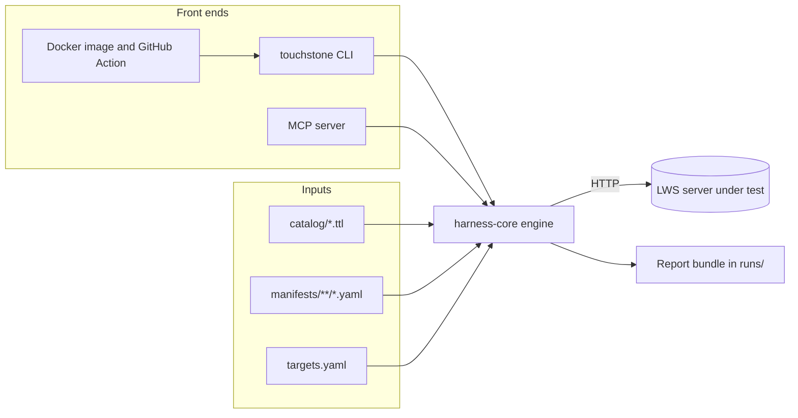
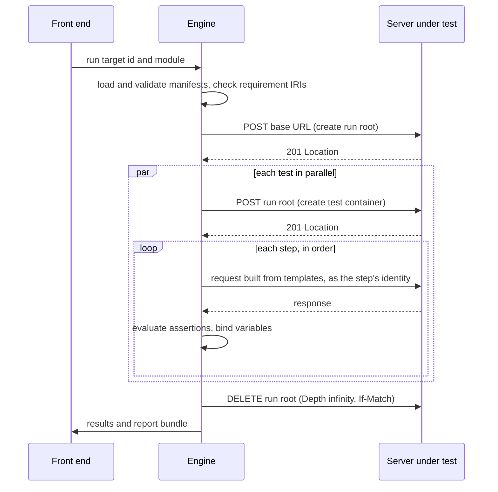

# How it works
{: .no_toc }

1. TOC
{:toc}

## The pieces

Touchstone is a Java 21 Maven project with four modules, plus the data they operate on.

| Path | What it holds |
|---|---|
| `harness-core` | The engine: catalog loading, manifest loading and validation, the executor, the assertion engine, run orchestration and every report writer. It has no Spring dependency, so every front end can use it. |
| `harness-fixtures` | Servers Touchstone controls: the reference LWS server, an OpenID Connect issuer, and did:key and Controlled Identifier (CID) credential fixtures. |
| `harness-cli` | The `touchstone` command (`run`, `coverage`, `diff`), built as one runnable jar. |
| `harness-mcp` | A Model Context Protocol server over the same engine, for AI agents. |
| `catalog/` | The requirements catalog: one Turtle file per specification document. |
| `manifests/` | The tests: YAML manifests grouped by module (`core`, `auth-oidc`). |
| `definitions/` | The proposed [YAML-LD test definitions](definitions.md). |
| `tools/extractor/` | Python scripts that extract clauses from a draft and detect drift. |
| `targets.yaml` | The registry of servers Touchstone is allowed to test. |

## One engine, three front ends

The command line, CI and the MCP server are three ways into the same engine. None of
them has its own execution logic, so a test behaves the same way whichever one runs it.

## Anatomy of a run

1. **Load and check.** `run` loads every `*.yaml` manifest under `manifests/<module>/`,
   including subdirectories. Each one is validated against the
   [manifest schema](writing-tests.md), and one invalid manifest stops the run. The engine
   then checks that every requirement IRI the manifests declare exists in the catalog. If
   one does not, the run is refused with exit code `2` before any request is sent. A
   report that cited a requirement that does not exist would claim something untrue.
2. **Resolve the target.** The target id is looked up in `targets.yaml`. The URL comes
   only from there.
3. **Provision.** The target's provisioning adapter prepares the run. The built-in `env`
   adapter creates a container named `touchstone-run-<runId>` under the target's base URL
   (`POST` with `Link: <https://www.w3.org/ns/lws#Container>; rel="type"`), acting as the
   provisioning identity. Every test works inside this run root.
4. **Execute.** Tests run in parallel, one virtual thread each. For every test, the
   executor:
   - skips the test if the target lacks a capability the test requires;
   - creates a fresh container for the test inside the run root, and exposes it as
     `${test.container}`;
   - runs the steps in order. For each step it fills in the templates, picks the
     identity, attaches its credentials, and sends the request. Redirects are not
     followed, each request has a timeout (15 seconds unless the step sets one), and
     nothing is retried. Then it evaluates the assertions and binds any variables later
     steps need.
   - stops at the first step that fails (outcome `FAILED`) or cannot run (outcome
     `ERROR`).
5. **Clean up.** The run root is deleted with `Depth: infinity`. The request carries
   `If-Match` with the run root's current ETag, because some servers require a
   conditional request. Cleanup never fails a run; if the server refuses, a warning names
   the container left behind.
6. **Report.** Results are sorted by test id and written as a
   [report bundle](reports.md).

## Isolation

- **No test depends on another.** There is no ordering between tests, and a test never
  reads anything another test created.
- **Each test owns a container.** A test creates what it needs inside
  `${test.container}`, so parallel tests cannot collide.
- **Steps are sequential.** Inside a test, steps run in order and can pass values forward
  with `bind`, for example the `Location` of a resource the test just created.
- **No retries.** A server that fails intermittently has a real defect, and Touchstone
  reports it as one.

## Identities

Manifests never contain credentials. They name abstract identities, such as `alice`,
`bob`, `anonymous` or `alice-expired`. For each step, the identity is resolved in this
order:

1. the step's own `as`;
2. the manifest's `as`;
3. the target's `defaultIdentity` property;
4. `anonymous`, which sends no credentials.

An explicit `as: anonymous` always wins. A test that checks what an unauthenticated
request receives therefore keeps its meaning on a target whose default identity is
authenticated.

The target's provisioning adapter turns a name into request headers. The built-in `env`
adapter sends `Authorization: Bearer <token>`, and reads the token from the target's
properties or from the environment. [Targets and credentials](targets.md) describes the
lookup.

## Capabilities

A test can declare the capabilities it needs, for example `capabilities: [authentication]`.
A target declares the capabilities it has. When a target lacks one, the test is
`SKIPPED`, and EARL records it as `inapplicable` rather than failed. The OpenID Connect
tests use this, so they run against a secured server and are skipped against an open
one.

## Outcomes

| Outcome | Meaning | EARL outcome |
|---|---|---|
| `PASSED` | Every step ran and every assertion held. | `earl:passed` |
| `FAILED` | An assertion did not hold. This is a finding about the server. It decides the outcome even when the same step then cannot bind a value it was meant to capture: a refused create has no `Location`, and the refusal is the finding. | `earl:failed` |
| `ERROR` | The harness could not finish the test, and no assertion had failed. Causes include a transport error, an unresolved variable, a missing credential, or a response that met every expectation of its step but lacked a value a later step needs. | `earl:cantTell` |
| `SKIPPED` | The target does not declare a capability the test requires. | `earl:inapplicable` |

[Reports and verdicts](reports.md) explains how outcomes become a conformance verdict.

## Reference servers and the self-test loop

A test suite needs testing too. Touchstone checks that each test passes against a server
that does the right thing and fails against one that does not. `harness-fixtures`
provides both kinds of server.

- **`RefLwsServer`** is an in-memory LWS server on embedded Jetty. It has three modes:
  - `OPEN`: no authentication. The core suite runs against it.
  - `SECURED`: validates bearer access tokens against the issuer's JWKS. It answers `401`
    with a `WWW-Authenticate` challenge when a credential is missing or invalid, and `403`
    when a valid identity is not the owner.
  - `BROKEN`: claims to protect resources but validates nothing and never refuses a
    request. The negative tests must fail against it.
- **`OidcIssuer`** publishes discovery metadata and a JWKS. `AccessTokens` mints valid
  tokens and deliberately broken ones: expired, wrong audience, wrong issuer, bad
  signature, unknown key and `alg: none`.
- **did:key and CID fixtures** generate real Ed25519 keys, sign self-issued JWTs, and
  host Controlled Identifier documents for a verifier to dereference.

`./mvnw verify` runs the loop:

- `CoreConformanceSuiteTest` runs every `core` manifest against an `OPEN` reference
  server through the JUnit `@TestFactory` loader.
- `OidcNegativeMatrixTest` runs the `auth-oidc` manifests twice. Against `SECURED` all
  of them must pass; against `BROKEN` the negative tests must fail. This proves the
  tests can tell a compliant server from a broken one.
- `SelfIssuedNegativeMatrixTest` checks the did:key and CID credential matrix: a valid
  credential verifies, and each broken variant is rejected.

## Tracking the draft

The catalog records, for every requirement, the dated Working Draft it came from and a
hash of the clause's exact text. `tools/extractor/check_drift.py` re-extracts a newer
draft and fails when a catalogued clause has changed or disappeared, so a moved
specification shows up as a failing check rather than as silently stale tests. See
[Requirements catalog](catalog.md).

## JSON-LD contexts are never fetched

Graph assertions parse JSON-LD responses with an offline document loader. The contexts
Touchstone understands are bundled with it: the LWS context, copied verbatim from the
draft, and the CID context. A response that names any other context fails the assertion
rather than triggering a network fetch. The context IRI comes from the server's response,
which is untrusted input. And `https://www.w3.org/ns/lws/v1` is not yet published, so a
verdict must not depend on fetching it.
