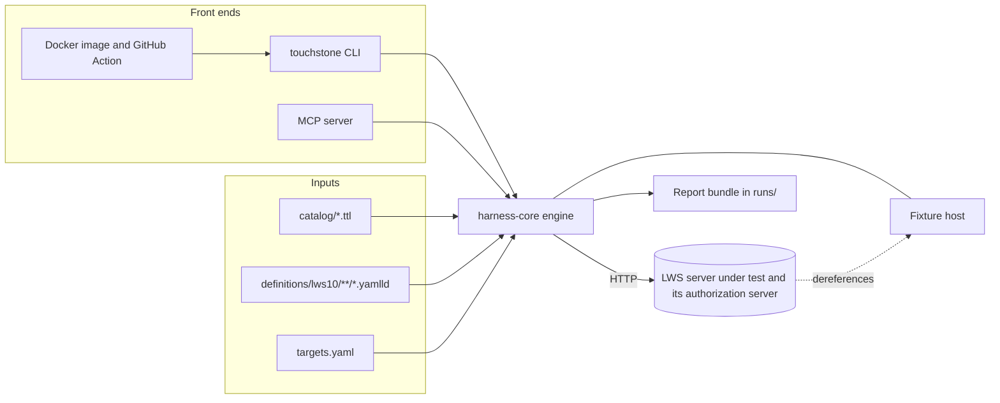
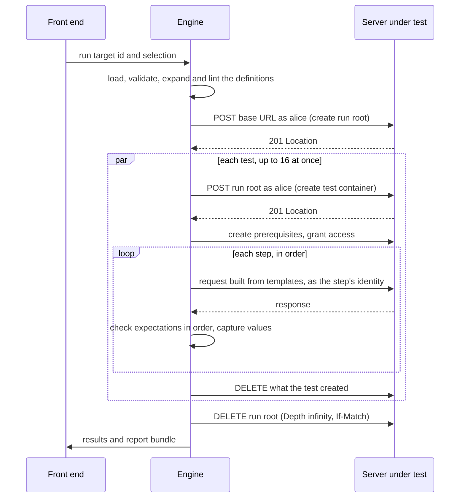

# How it works
{: .no_toc }

1. TOC
{:toc}

## The pieces

Touchstone is a Java 21 Maven project with four modules, plus the data they operate on.

| Path | What it holds |
|---|---|
| `harness-core` | The engine: catalog loading, the definitions loader and lint, the engine that runs them, identities and credentials, and every report writer. It has no Spring dependency, so every front end can use it. |
| `harness-fixtures` | Servers Touchstone controls: the reference LWS server, the reference authorization server, and broken twins of both. |
| `harness-cli` | The `touchstone` command (`run`, `coverage`, `diff`), built as one runnable jar. |
| `harness-mcp` | A Model Context Protocol server over the same engine, for AI agents. |
| `catalog/` | The requirements catalog: one Turtle file per specification document. |
| `definitions/` | The tests: [YAML-LD definitions](definitions.md), format 0.2.0, and the contract that says how to run them. |
| `tools/` | Python and Node scripts that check the definitions, extract clauses from a draft, and detect drift. |
| `targets.yaml` | The registry of servers Touchstone is allowed to test. |

## One engine, three front ends

The command line, CI and the MCP server are three ways into the same engine. None of
them has its own execution logic, so a test behaves the same way whichever one runs it.

## Anatomy of a run

The contract for every step below is
[`definitions/EXECUTION.md`]().

1. **Load and check.** Every definition is parsed as YAML 1.2, validated against the JSON
   Schema, expanded as JSON-LD in safe mode, and linted: names unique, variables bound,
   identities known, no example hosts, and every requirement IRI in the catalog. Any
   failure stops the run with exit code `2` before a request is sent.
2. **Resolve the target.** The target id is looked up in `targets.yaml`. The URL comes
   only from there.
3. **Create the run root.** The engine POSTs to the target's base URL as alice, with
   `Link: <https://www.w3.org/ns/lws#Container>; rel="type"`. Every test works inside this
   container. If it cannot be created, there is no run and no verdict (exit code `2`).
4. **Run the tests,** in parallel on virtual threads, 16 at a time unless the target sets
   `parallelism`. For each test the engine:
   - makes it inapplicable, without sending anything, if the target lacks a capability
     the test or one of its identities requires;
   - creates the test's own container, `${test.container}`;
   - creates its prerequisites and grants the access they declare;
   - runs its steps in order: fills in the templates, adds the identity's credentials,
     sends the request (no redirects, a 30-second timeout, no retries), and checks the
     expectations in the order the contract fixes;
   - stops at the first failed expectation: `failed`, or `inapplicable` in a precondition
     step.
5. **Clean up.** Each test deletes what it created, grants included, then its container.
   The run root goes last, with `Depth: infinity` and `If-Match`; when a server refuses a
   recursive delete (a MAY), the engine deletes bottom-up. Cleanup never changes an
   outcome; a warning names anything left behind.
6. **Report.** Results are written, in the order the tests were selected, as a
   [report bundle](reports.md).

## Isolation

- **No test depends on another.** There is no ordering between tests, and a test never
  reads anything another test created.
- **Each test owns a container.** A test creates what it needs inside
  `${test.container}`, so parallel tests cannot collide.
- **Steps are sequential.** Inside a test, steps run in order and pass values forward
  with `capture`, for example the `Location` of a resource the test just created.
- **No retries.** A server that fails intermittently has a real defect, and Touchstone
  reports it as one.

## Identities

Definitions never contain credentials. They name identities from
`definitions/lws10/identities.yamlld`: `anonymous`, `alice` (the storage owner, and the
default), `bob`, fault identities such as `alice-expired`, and the subject credentials of
the authentication suites. A step acts as its own `as`, else the test's, else alice.

Where alice's and bob's access tokens come from depends on the target:

1. **Minted by the harness,** when the target declares `HarnessIssuedTokens` and gives the
   authorization server's signing key.
2. **Exchanged** at the authorization server, when the target gives a did:key for the
   identity.
3. **Static,** from `token.<name>` or the environment variable `TOUCHSTONE_TOKEN_<NAME>`.
4. **None,** on a target that does not enforce authentication.

A fault identity is its basis with one defect. The signature faults (a corrupted
signature, `alg: none`, an unknown key) are derived from any real token; the others need
the signing key. [Authentication](auth.md) and [Targets and credentials](targets.md) cover
the details.

## Capabilities

Some things a server cannot reveal about itself: whether it enforces authentication at
all, whether the harness holds its authorization server's key, whether it can reach the
harness's fixture host, whether it trusts the harness's SAML identity provider. A target
declares these as capabilities (`Authentication`, `HarnessIssuedTokens`,
`ReachableFixtures`, `SamlTrust`), and a test that needs one the target lacks is
inapplicable. An optional feature the server can reveal, such as an access grant service,
is discovered instead, and its absence makes the tests that need it inapplicable too.

## Outcomes

| Outcome | Meaning | EARL outcome |
|---|---|---|
| `passed` | Every step passed. | `earl:passed` |
| `failed` | An expectation failed outside a precondition. This is a finding about the server, even when the same response also left a value uncaptured: a refused create has no `Location`, and the refusal is the finding. | `earl:failed` |
| `inapplicable` | A capability, identity, service or precondition the test needs is absent. | `earl:inapplicable` |
| `cantTell` | The harness could not decide: a transport error, a timeout, a failed prerequisite, or a variable that could not be resolved for any other reason. | `earl:cantTell` |

Each test has one level, and only MUST tests decide conformance. [Reports and
verdicts](reports.md) explains how outcomes become a verdict.

## Reference servers and the self-test loop

A test suite needs testing too. Touchstone checks that each test passes against a server
that does the right thing, and fails against one that does not. `harness-fixtures`
provides both.

- **`RefLwsServer`** is an in-memory LWS server on embedded Jetty that follows the 21
  September 2026 Working Draft: containers, data resources, conditional requests, byte
  ranges, linksets, the storage description, access grants and access requests. It has
  three modes:
  - `OPEN`: no authentication;
  - `SECURED`: validates access tokens against the reference authorization server, answers
    `401` with a challenge for a missing or invalid token and `403` for a valid agent
    without access, and honours grants;
  - `BROKEN`: claims to protect resources but never challenges or refuses.
- **`RefAuthorizationServer`** publishes RFC 8414 metadata and a JWKS, and exchanges
  did:key, CID, OpenID Connect and SAML subject tokens for access tokens (RFC 8693),
  validating each the way its suite says. Its broken twin exchanges anything.
- **`ReferenceScenario`** wires them together and says how the harness is configured for
  them.

`./mvnw verify` runs the loop in `DefinitionsSelfTest`:

- against the secured deployment, all 101 definitions run, and every one passes except
  the notification test, which is inapplicable because the reference advertises no
  notification service it does not have;
- against an open storage, exactly the tests that need authentication are inapplicable;
- against the broken authorization server, the 19 credential tests of the four
  authentication suites fail, and so does the unknown-storage test;
- against the broken storage, its 14 access-control tests fail.

Each broken twin fails exactly the tests that exist to catch it, which is what shows those
tests can fail.

## Tracking the draft

The catalog records, for every requirement, the dated Working Draft it came from and a
hash of the clause's exact text. `tools/extractor/check_drift.py` re-extracts a newer
draft and fails when a catalogued clause has changed or disappeared, so a moved
specification shows up as a failing check rather than as silently stale tests. See
[Requirements catalog](catalog.md).

## JSON-LD contexts are never fetched

The engine expands the definitions with their own two contexts, and parses JSON-LD
responses, when it compares negotiated representations, with an offline document loader.
The response contexts Touchstone understands are bundled with it: the LWS context, copied
verbatim from the draft, and the CID context. A response that names any other context
cannot be parsed rather than triggering a network fetch. The context IRI comes from the
server's response, which is untrusted input. And `https://www.w3.org/ns/lws/v1` is not yet
published, so a verdict must not depend on fetching it.
